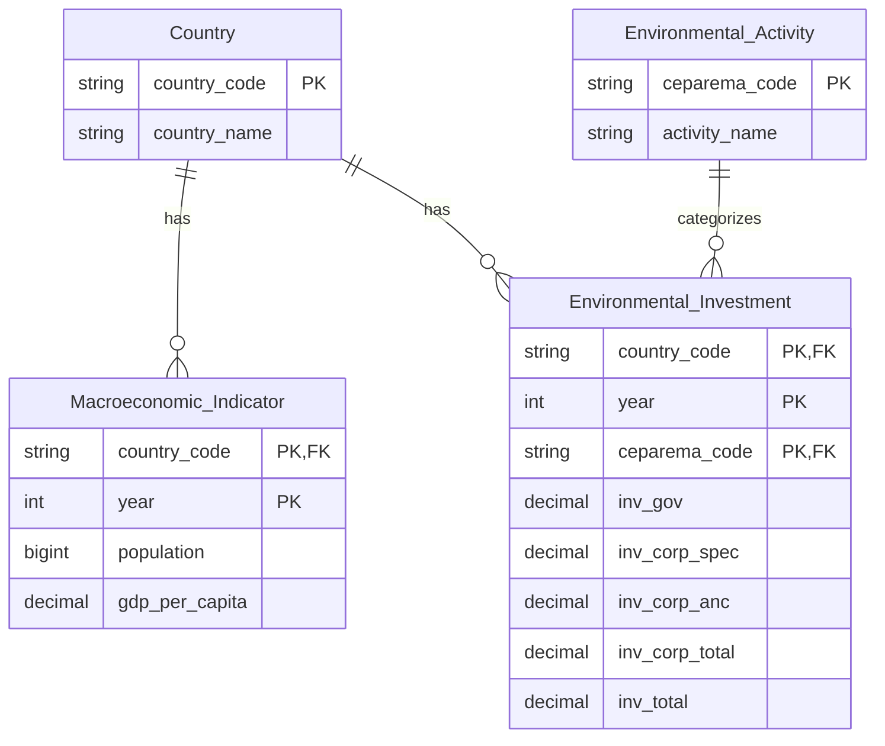

# Entity-Relationship Diagram

```mermaid
erDiagram
    Country {
        string country_code PK
        string country_name
    }
    Environmental_Activity {
        string ceparema_code PK
        string activity_name
    }
    Macroeconomic_Indicator {
        string country_code PK, FK
        int year PK
        bigint population
        decimal gdp_per_capita
    }
    Environmental_Investment {
        string country_code PK, FK
        int year PK
        string ceparema_code PK, FK
        decimal inv_gov
        decimal inv_corp_spec
        decimal inv_corp_anc
        decimal inv_corp_total
        decimal inv_total
    }

    Country ||--o{ Macroeconomic_Indicator : "has"
    Country ||--o{ Environmental_Investment : "has"
    Environmental_Activity ||--o{ Environmental_Investment : "categorizes"
```
